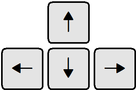

Classic Arcade Game Clone: Frogger
==================================
## Summary
---
Frogger Arcade is a variation of the classic Frogger arcade game.
## Installation
---
To run the application:
1. Download the GitHub zip file or clone the repository onto your local workstation:
    * zip file https://github.com/SashankAllamraju/frontend-nanodegree-arcade-game/archive/master.zip
    * git clone https://github.com/SashankAllamraju/frontend-nanodegree-arcade-game.git
2. Open a browser window and navigate to the index.html file in your application's directory.
## Instructions
---
1. Use the 'arrow' keys to move the player.
2. Grab these!!!
    * Heart - Gain 1 life
    * Orange Gem - Reduces bugs' speed for 2 seconds
    * Green Gem - 10 points
    * Blue Gem - 20 points
3. Stay Away from these!!!
    * Bugs - Lose 1 life
    * Water - Lose 1 life
    * Rock - Lose 1 life
## Project Requirements
---
Students should use this [rubric](https://review.udacity.com/#!/projects/2696458597/rubric) for self-checking their submission.

For detailed instructions on how to get started, check out this [guide](https://docs.google.com/document/d/1v01aScPjSWCCWQLIpFqvg3-vXLH2e8_SZQKC8jNO0Dc/pub?embedded=true).
